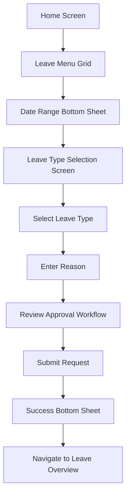
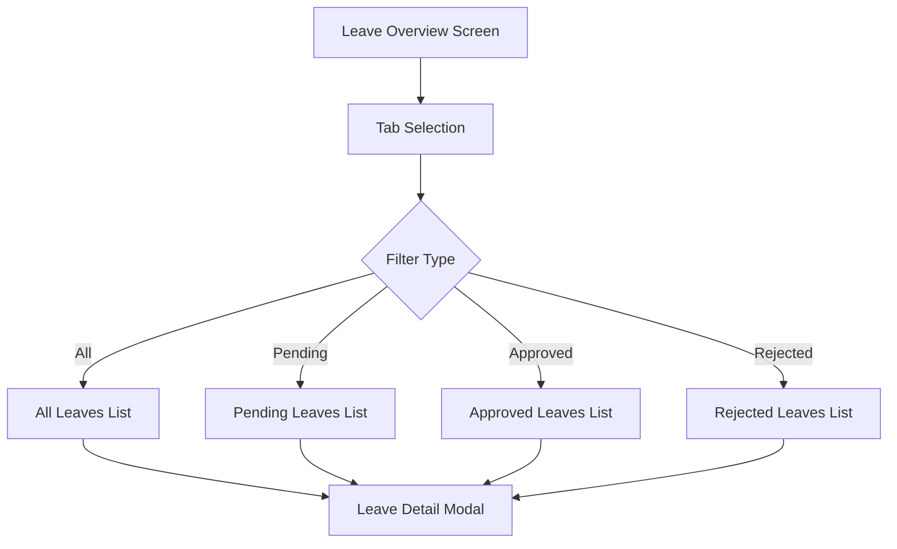
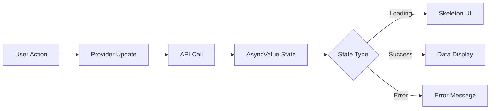

# Leave Feature UI/UX Implementation Guide

## Table of Contents
1. [Overview](#overview)
2. [Architecture & Components](#architecture--components)
3. [User Journey & Flow](#user-journey--flow)
4. [UI Component Analysis](#ui-component-analysis)
5. [Design System Implementation](#design-system-implementation)
6. [Usability Heuristics Implementation](#usability-heuristics-implementation)
7. [Accessibility Features](#accessibility-features)
8. [Performance Optimizations](#performance-optimizations)
9. [Testing & Quality Assurance](#testing--quality-assurance)
10. [Future Improvements](#future-improvements)

---

## Overview

The Leave Feature is a comprehensive module within the HR app that allows employees to request, view, and manage their leave applications. The implementation follows Jakob Nielsen's usability heuristics and modern mobile UX principles to provide an intuitive and efficient user experience.

### Key Features
- **Leave Request Submission**: Multi-step form with date selection, leave type selection, and reason input
- **Leave Overview Dashboard**: Visual representation of leave balance and history
- **Status Tracking**: Real-time status updates with approval workflow visibility
- **Leave History**: Comprehensive list view with filtering capabilities

---

## Architecture & Components

### Core Screens
```
lib/screens/leave/
├── leave_overview/
│   ├── leave_overview_screen.dart          # Main dashboard with pie chart and list
│   └── widgets/
│       ├── pie_chart.dart                  # Visual leave balance representation
│       └── leave_list_tile.dart            # Individual leave item component
├── leave_request/
│   ├── leave_type_selection_screen.dart    # Main leave request form
│   └── widgets/
│       ├── date_range_bottom_sheet.dart    # Date selection component
│       ├── leave_selected_dates_header.dart # Date range display
│       ├── leave_type_option_card.dart     # Leave type selection cards
│       ├── leave_reason_input.dart         # Reason input field
│       ├── leave_approval_workflow.dart    # Approval process visualization
│       ├── leave_submit_button.dart        # Smart submit button
│       ├── leave_success_bottom_sheet.dart # Success confirmation
│       └── leave_warning_bottom_sheet.dart # Warning/error messages
└── leave_request_screen.dart               # Entry point (currently empty)
```

### Data Flow
```
User Input → Provider State Management → API Integration → UI Updates
     ↓              ↓                      ↓              ↓
Date Selection → LeaveProvider → Backend → Success/Error States
Leave Type     → StaffProvider → Staff Info → UI Feedback
Reason Input   → AsyncValue    → Leave Data → Visual Updates
```

---

## User Journey & Flow

### 1. Leave Request Journey


### 2. Leave Overview Journey


### 3. State Management Flow


---

## UI Component Analysis

### 1. Leave Overview Screen (`leave_overview_screen.dart`)

**Purpose**: Central dashboard for viewing leave balance and history

**Key Features**:
- **Tab Navigation**: Four tabs (All, Pending, Approved, Rejected)
- **Pie Chart Visualization**: Leave balance representation
- **List View**: Filterable leave history
- **Pull-to-Refresh**: Data synchronization
- **Loading States**: Skeleton implementation

**UX Principles Applied**:
- ✅ **Visibility of System Status**: Loading skeletons, refresh indicators
- ✅ **Consistency**: Unified tab interface, consistent card design
- ✅ **Recognition over Recall**: Visual status indicators, color coding

### 2. Leave Type Selection Screen (`leave_type_selection_screen.dart`)

**Purpose**: Main form for creating new leave requests

**Key Features**:
- **Multi-step Process**: Date → Type → Reason → Submit
- **Smart Form Validation**: Real-time field validation
- **Approval Workflow Preview**: Shows supervisor and manager information
- **Dynamic UI**: Conditional field display based on selections

**UX Principles Applied**:
- ✅ **User Control**: Cancel buttons, edit date functionality
- ✅ **Error Prevention**: Disabled submit until valid data
- ✅ **Minimalist Design**: Progressive disclosure of form fields

### 3. Component Widgets Analysis

#### Date Range Bottom Sheet (`date_range_bottom_sheet.dart`)
```dart
// Key Features:
- Native date picker integration
- Duration calculation display
- Clear/Confirm action buttons
- Visual feedback for selection
```

#### Leave Type Option Card (`leave_type_option_card.dart`)
```dart
// Key Features:
- Card-based selection interface
- Visual selection indicators
- Icon-based categorization
- Hover/tap feedback states
```

#### Leave Reason Input (`leave_reason_input.dart`)
```dart
// Key Features:
- Multi-line text input
- Character count validation
- Error state visualization
- Helper text guidance
```

#### Leave Approval Workflow (`leave_approval_workflow.dart`)
```dart
// Key Features:
- Step-by-step approval visualization
- Avatar-based person identification
- Status tracking display
- Informational descriptions
```

---

## Design System Implementation

### Color Scheme
```dart
// Primary Colors
Primary: PalmColors.primary           // Main brand color
Background: PalmColors.white          // Screen backgrounds
Cards: PalmColors.backGroundColor     // Card backgrounds

// Status Colors
Success: PalmColors.success           // Approved states
Warning: PalmColors.warning           // Pending states
Error: PalmColors.danger             // Rejected/Error states

// Text Colors
Normal: PalmColors.textNormal        // Primary text
Light: PalmColors.textLight          // Secondary text
Disabled: PalmColors.disabled        // Inactive elements
```

### Typography System
```dart
// Text Styles
Title: PalmTextStyles.title          // Screen titles
Body: PalmTextStyles.body            // Regular content
Caption: PalmTextStyles.caption      // Helper text
Label: PalmTextStyles.label          // Form labels
Button: PalmTextStyles.button        // Button text
```

### Spacing System
```dart
// Spacing Constants
XXS: PalmSpacings.xxs               // 2px
XS: PalmSpacings.xs                 // 4px
S: PalmSpacings.s                   // 8px
M: PalmSpacings.m                   // 16px
L: PalmSpacings.l                   // 24px
XL: PalmSpacings.xl                 // 32px
```

### Component Styling Patterns

#### Card Components
```dart
decoration: BoxDecoration(
  color: PalmColors.white,
  borderRadius: BorderRadius.circular(PalmSpacings.radius),
  boxShadow: [
    BoxShadow(
      color: PalmColors.dark.withOpacity(0.05),
      blurRadius: 8,
      offset: const Offset(0, 2),
    ),
  ],
)
```

#### Button Styles
```dart
// Primary Button
backgroundColor: PalmColors.primary
foregroundColor: PalmColors.white
borderRadius: PalmSpacings.radius

// Secondary Button
backgroundColor: Colors.transparent
foregroundColor: PalmColors.primary
border: PalmColors.primary
```

---

## Usability Heuristics Implementation

### 1. Visibility of System Status ✅
**Implementation**:
- **Loading States**: Skeleton UI during data fetch
- **Progress Indicators**: Submit button loading state
- **Status Badges**: Color-coded leave status indicators
- **Real-time Feedback**: Form validation messages

**Code Examples**:
```dart
// Skeleton loading in leave overview
Skeletonizer(
  enabled: isLoading,
  effect: const ShimmerEffect(),
  child: ListView(...),
)

// Submit button loading state
if (isSubmitting)
  SizedBox(
    width: 18,
    height: 18,
    child: CircularProgressIndicator(...),
  )
```

### 2. Match Between System and Real World ✅
**Implementation**:
- **Familiar Terminology**: "Annual Leave", "Sick Leave", "Special Leave"
- **Natural Date Flow**: Start date → End date selection
- **Real-world Approval Process**: Supervisor → Manager workflow
- **Calendar Metaphors**: Date picker interfaces

### 3. User Control and Freedom ✅
**Implementation**:
- **Cancel Buttons**: Available at every step
- **Edit Functionality**: Modify dates after selection
- **Back Navigation**: AppBar back buttons
- **Draft Saving**: Form state preservation

**Code Examples**:
```dart
// Cancel button in app bar
TextButton(
  onPressed: isSubmitting ? null : () => Navigator.pop(context),
  child: Text('Cancel'),
)

// Edit dates functionality
IconButton(
  onPressed: _onEditDates,
  icon: Icon(Icons.edit),
)
```

### 4. Consistency and Standards ✅
**Implementation**:
- **Design System**: Consistent color and typography usage
- **Navigation Patterns**: Standard AppBar and tab interfaces
- **Icon Usage**: Consistent iconography throughout
- **Button Styles**: Unified button styling

### 5. Error Prevention ✅
**Implementation**:
- **Field Validation**: Real-time input validation
- **Disabled States**: Submit button disabled until valid
- **Date Constraints**: Future date limitations
- **Required Field Indicators**: Visual field requirements

**Code Examples**:
```dart
// Submit button validation
ElevatedButton(
  onPressed: (canContinue && !isSubmitting) ? onPressed : null,
  // ... button styling
)

// Reason field validation
if (_reasonController.text.trim().isEmpty) {
  // Show validation error
}
```

### 6. Recognition Rather Than Recall ✅
**Implementation**:
- **Auto-filled Data**: Staff information pre-populated
- **Visual Selection**: Selected states clearly indicated
- **Persistent Labels**: Field labels always visible
- **Status Indicators**: Visual status representation

### 7. Flexibility and Efficiency of Use ✅
**Implementation**:
- **Quick Actions**: Direct menu access from home
- **Keyboard Shortcuts**: Enter to submit forms
- **Smart Defaults**: Current date as default start
- **Gesture Support**: Pull-to-refresh functionality

### 8. Aesthetic and Minimalist Design ✅
**Implementation**:
- **Progressive Disclosure**: Show relevant fields only
- **Clean Layout**: Single-column form design
- **Whitespace Usage**: Proper spacing between elements
- **Visual Hierarchy**: Clear information hierarchy

### 9. Help Users Recognize, Diagnose, and Recover from Errors ✅
**Implementation**:
- **Clear Error Messages**: Specific, actionable error text
- **Field-level Validation**: Immediate feedback on input
- **Recovery Actions**: Retry buttons for failed operations
- **Visual Error States**: Red highlighting for invalid fields

**Code Examples**:
```dart
// Error state handling
if (leaveProvider.leaveList?.state == AsyncValueState.error) {
  return Center(
    child: Column(
      children: [
        Icon(Icons.error_outline, color: Colors.red),
        Text('Error loading leave data'),
        ElevatedButton(
          onPressed: _loadData,
          child: Text('Retry'),
        ),
      ],
    ),
  );
}
```

### 10. Help and Documentation ✅
**Implementation**:
- **Helper Text**: Guidance for complex fields
- **Approval Workflow Info**: Clear process explanation
- **Tooltips**: Additional context where needed
- **Success Confirmations**: Clear completion messages

---

## Accessibility Features

### Screen Reader Support
- **Semantic Labels**: Meaningful widget labels for screen readers
- **Focus Management**: Proper focus traversal order
- **Announcements**: Status changes announced to assistive technologies

### Touch Target Sizing
- **Minimum Size**: 44px minimum touch targets
- **Adequate Spacing**: Sufficient space between interactive elements
- **Easy Reach**: Important actions within thumb reach

### Color and Contrast
- **High Contrast**: Sufficient color contrast ratios
- **Color Independence**: Information not dependent on color alone
- **Status Indicators**: Multiple ways to convey status (color + icon + text)

### Implementation Examples
```dart
// Semantic labels
Semantics(
  label: 'Select leave type',
  child: LeaveTypeOptionCard(...),
)

// Proper button sizing
SizedBox(
  width: double.infinity,
  height: 52, // Minimum touch target height
  child: ElevatedButton(...),
)
```

---

## Performance Optimizations

### State Management Efficiency
- **Provider Pattern**: Efficient state updates with Provider
- **AsyncValue**: Proper loading/error state management
- **Selective Rebuilds**: Consumer widgets for targeted updates

### Memory Management
- **Controller Disposal**: Proper disposal of text controllers
- **Image Optimization**: Efficient image loading and caching
- **List Performance**: Optimized list rendering for large datasets

### Network Optimization
- **Caching Strategy**: Intelligent data caching
- **Offline Support**: Graceful offline state handling
- **Pagination**: Efficient data loading for large lists

### Code Examples
```dart
// Proper controller disposal
@override
void dispose() {
  _reasonController.dispose();
  _tabController.dispose();
  _scrollController.dispose();
  super.dispose();
}

// Efficient state updates
Consumer2<LeaveProvider, StaffProvider>(
  builder: (context, leaveProvider, staffProvider, child) {
    // Only rebuilds when these providers change
  },
)
```

---

## Testing & Quality Assurance

### Unit Testing Coverage
- **Widget Tests**: Individual component testing
- **Provider Tests**: State management validation
- **Form Validation**: Input validation testing

### Integration Testing
- **User Flow Testing**: Complete journey validation
- **API Integration**: Backend communication testing
- **Cross-platform Testing**: iOS and Android compatibility

### Usability Testing
- **User Acceptance Testing**: Real user feedback collection
- **Accessibility Testing**: Screen reader and keyboard navigation
- **Performance Testing**: Load time and responsiveness validation

### Test Implementation Examples
```dart
// Widget testing
testWidgets('Leave type selection works correctly', (WidgetTester tester) async {
  await tester.pumpWidget(LeaveTypeSelectionScreen(...));
  await tester.tap(find.byType(LeaveTypeOptionCard).first);
  expect(find.text('Annual'), findsOneWidget);
});

// Provider testing
test('Leave provider loads data correctly', () async {
  final provider = LeaveProvider();
  await provider.getLeaveList();
  expect(provider.leaveList?.state, AsyncValueState.success);
});
```

---

## Future Improvements

### Short-term Enhancements
1. **Offline Support**: Enable form drafting without internet connection
2. **Push Notifications**: Real-time approval status updates
3. **Attachment Support**: Document upload for medical leave
4. **Quick Templates**: Saved leave reason templates

### Medium-term Features
1. **Calendar Integration**: Sync with device calendar
2. **Team Calendar**: View team leave schedule
3. **Bulk Operations**: Multiple leave request management
4. **Advanced Filtering**: Complex search and filter options

### Long-term Vision
1. **AI Assistance**: Smart leave suggestion based on patterns
2. **Predictive Analytics**: Leave balance optimization
3. **Voice Interface**: Voice-activated leave requests
4. **Integration APIs**: Third-party calendar and HR system integration

### Technical Debt Reduction
1. **Code Splitting**: Modular architecture improvements
2. **Performance Monitoring**: Real-time performance tracking
3. **Security Enhancements**: Advanced data protection
4. **Internationalization**: Multi-language support

---

## Conclusion

The Leave Feature UI/UX implementation successfully combines modern Flutter development practices with established usability principles to create an intuitive and efficient user experience. The modular architecture, comprehensive state management, and attention to accessibility ensure that the feature meets both current user needs and future scalability requirements.

The implementation demonstrates strong adherence to Jakob Nielsen's usability heuristics while maintaining consistency with the overall HR app design system. Continuous user feedback and iterative improvements will ensure the feature remains effective and user-friendly as the application evolves.

---

## References

- [Jakob Nielsen's 10 Usability Heuristics](https://www.nngroup.com/articles/ten-usability-heuristics/)
- [Flutter Accessibility Guidelines](https://docs.flutter.dev/development/accessibility-and-localization/accessibility)
- [Material Design Guidelines](https://material.io/design)
- [Provider State Management](https://pub.dev/packages/provider)
- [Mobile UX Best Practices](https://www.nngroup.com/articles/mobile-ux/)

---

*Last Updated: August 13, 2025*
*Document Version: 1.0*
*Author: AI Assistant*
